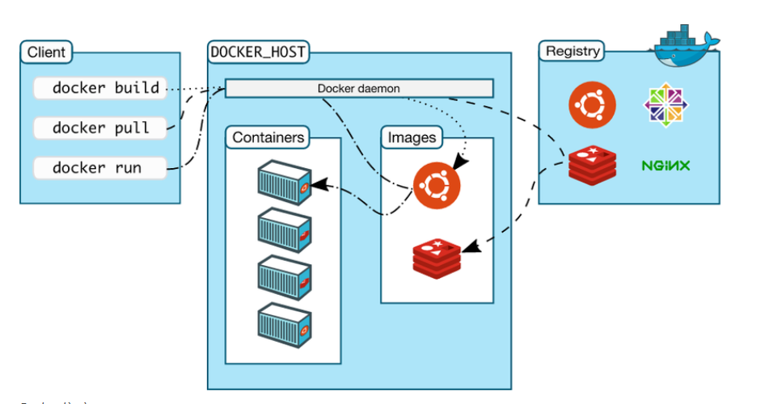
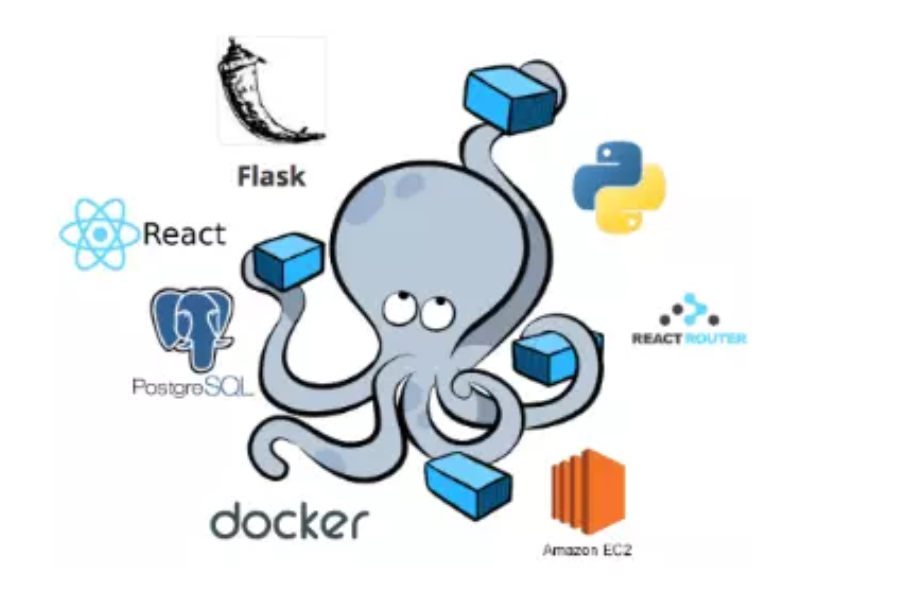
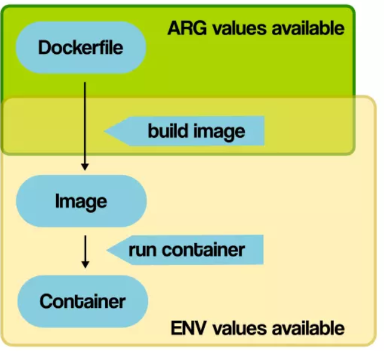
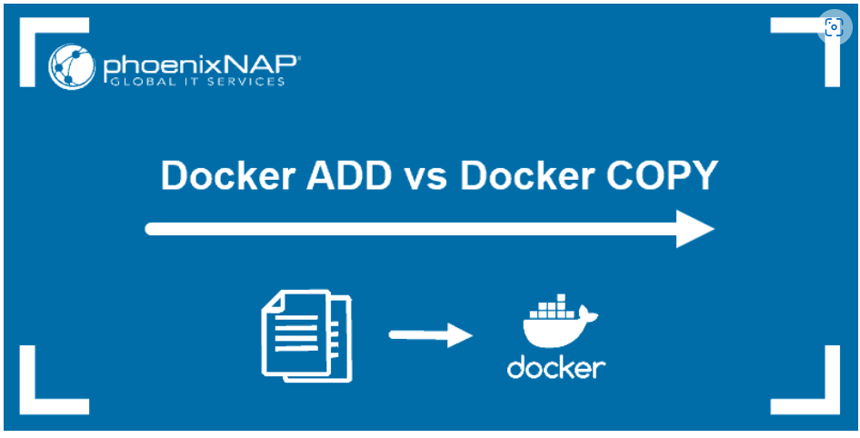

# DOCKER
## Content

- [Docker và Docker-Compose](#Docker-và-Docker-Compose)
- [What are the differences between these instructions?](#What-are-the-differences-between-these-instructions?)
- [Xây dựng Docker-compose đóng gói và chạy webapp](#Xây-dựng-Docker-compose-đóng-gói-và-chạy-webapp)
- [Nguồn tham khảo](#Nguồn-tham-khảo)

---

## Docker và Docker-Compose
### Docker
#### Docker và Container
**Docker** là một nền tảng để cung cấp cách để building, deploying và running ứng dụng dễ dàng hơn bằng cách sử dụng các containers (trên nền tảng ảo hóa). Ban đầu viết bằng Python, hiện tại đã chuyển sang Golang.


Các **Containers** cho phép lập trình viên đóng gói một ứng dụng với tất cả các phần cần thiết, chẳng hạn như thư viện và các phụ thuộc khác, và gói tất cả ra dưới dạng một package.

Bằng cách đó, nhờ vào container, ứng dụng sẽ chạy trên mọi máy Linux khác bất kể mọi cài đặt tùy chỉnh mà máy có thể có khác với máy được sử dụng để viết code.
#### Các khái niệm liên quan

- Docker Engine : là thành phần chính của Docker, như một công cụ để đóng gói ứng dụng
- Docker Hub : là một “github for docker images”. Trên DockerHub có hàng ngàn public images được tạo bởi cộng đồng cho phép bạn dễ dàng tìm thấy những image mà bạn cần. Và chỉ cần pull về và sử dụng với một số config mà bạn mong muốn.
- Images: là một khuôn mẫu để tạo một container. Thường thì image sẽ dựa trên 1 image có sẵn với những tùy chỉnh thêm. Ví dụ bạn build 1 image dựa trên image Centos mẫu có sẵn để chạy Nginx và những tùy chỉnh, cấu hình để ứng dụng web của bạn có thể chạy được.
- Container: là một instance của một image. Bạn có thể create, start, stop, move or delete container dựa trên Docker API hoặc Docker CLI.
- Docker Client: là một công cụ giúp người dùng giao tiếp với Docker host.
- Docker Daemon: lắng nghe các yêu cầu từ Docker Client để quản lý các đối tượng như Container, Image, Network và Volumes thông qua REST API. Các Docker Daemon cũng giao tiếp với nhau để quản lý các Docker Service.
- Dockerfile: là một tập tin bao gồm các chỉ dẫn để build một image .
- Volumes: là phần dữ liệu được tạo ra khi container được khởi tạo.
### Docker-Compse

Docker compose là công cụ dùng để định nghĩa và run multi-container cho Docker application. Với compose bạn sử dụng file YAML để config các services cho application của bạn. Sau đó dùng command để create và run từ những config đó. Sử dụng cũng khá đơn giản chỉ với ba bước:

- Khai báo app’s environment trong Dockerfile.
- Khai báo các services cần thiết để chạy application trong file docker-compose.yml.
- Run docker-compose up để start và run app.

## What are the differences between these instructions?

### *ARG* và *ENV*

- **ARG** hay còn gọi là biến build-time chỉ hoạt động trong quá trình build-image, hoạt động kể từ thời điểm chúng được khai báo trong Dockerfile trong câu lệnh ARG cho đến khi image được tạo. Khi chạy container, chúng ta không thể truy cập giá trị của các biến ARG và chúng chạy duới giá trị mặc định, nếu thay đổi lệnh build sẽ lỗi.

- **ENV** có sẵn trong quá trình xây dựng, ngay khi bạn khai báo chúng với một command của ENV. Tuy nhiên, không giống như ARG, khi build xong image, các container chạy image có thể truy cập giá trị ENV này.Bên cạnh đó các container chạy từ image có thể ghi đè giá trị của ENV.



### *COPY* và *ADD*

Lệnh **COPY** sẽ sao chép các tệp mới từ src và thêm chúng vào hệ thống tệp của bộ chứa tại đường dẫn dest
```
  COPY <src> <dest>
```
 Lệnh **ADD** cũng sao chép các tệp mới từ src và thêm chúng vào hệ thống tệp của bộ chứa tại đường dẫn dest
 ```
  ADD ["< src >",... "< dest >"] 
```


Nhìn chung **COPY** và **ADD** khá tương tự nhau về mặt chức năng, xong chúng vẫn có những diểm khác nhau cơ bản.
 
- **COPY** sao chép một tập tin / thư mục từ máy chủ của bạn vào image.

- **ADD** sao chép một tập tin / thư mục từ máy chủ vào image, nhưng cũng có thể tìm nạp các URL từ xa, trích xuất các tệp TAR, v.v ... 

### *CMD* và *ENTRYPOINT*
Cả hai lệnh (**CMD** và **ENTRYPOINT**) có thể được chỉ định ở dạng shell form hoặc dạng exec form.
- Dạng shell form 
```
<instruction> <command>
```
- Dạng exec form
```
<instruction> ["executable", "param1", "param2", ...]
```


Thoạt nhìn, chúng đều được sử dụng để chỉ định và thực thi các lệnh nhưng chúng cũng có những điểm khác nhau.
- **CMD** cho phép ta set default command, có nghĩa là command này sẽ chỉ được chạy khi run container mà không chỉ định một command. CMD thì tất cả sẽ bị ignore ngoại trừ lệnh CMD cuối cùng.
- **ENTRYPOINT** cho phép ta cấu hình container sẽ chạy dưới dạng thực thi. Nó tương tự như CMD, vì nó cũng cho phép ta chỉ định một lệnh với các tham số. Sự khác biệt là lệnh ENTRYPOINT và các tham số không bị ignore khi Docker container chạy.

## Xây dựng Docker-compose đóng gói và chạy webapp

### Yêu cầu:
Thiết lập ứng dụng web 3 tầng hiển thị thông tin sinh viên trong lớp học trên trình duyệt bằng Docker-compose. Dựa trên các base-image:
- nginx:1.22.0-alpine
- python:3.9
- mongo:5.0
### Chuẩn bị
Để cài đặt được webapp ta cần chuẩn bị: 
- Máy chủ để build image
- Docker và kiến thức về Docker [(Hướng dẫn cài đặt)](https://vsudo.net/blog/docker-ubuntu.html)
- Docker-compose và kiến thức về Docker-compose [(Hướng dẫn cài đặt)](https://thuanbui.me/huong-dan-cai-dat-docker-docker-compose-tren-ubuntu-20-04/).

Cấu trúc file sẽ gồm có:
```bash
__ project-name
    |__ ningx
        |__ Dockerfile
        |__ conf.d
            |__ app.c
    |__ app
        |__ Dockerfile
        |__ requirements.txt
        |__ app.py
        |__ wgsi.py
        |__ templates
           |__ index.html
    |__ docker-compose.yml
    |__ init-db-js
```
### Tiến hành xây dựng
#### Bước 1: Viết cấu hình cho file Docker-compose

<p>File <code>docker-compose.yml</code> cho phép ta xây dựng hạ tầng một ứng dụng web bao gồm webserver, app, database một cách riêng lẻ. Các dịch vụ có thể kết nối với nhau và có volume riêng để lưu trữ</p>
```
mkdir flaskapp
```
Di chuyển vào thư mục mới tạo:

```
cd flaskapp
```
Tiếp theo, tạo file <code>docker-compose.yml</code>:
```
nano docker-compose.yml
```
Bây giờ bạn sẽ xác định flask là dịch vụ đầu tiên trong tệp  <code>docker-compose.yml</code> . Thêm code sau để xác định dịch vụ Flask:
```
version: '3'
services:

  flask:
    build:
      context: app
      dockerfile: Dockerfile
    container_name: flask
    image: python3.9
    restart: unless-stopped
    environment:
      APP_ENV: "prod"
      APP_DEBUG: "False"
      APP_PORT: 5000
    volumes:
      - appdata:/var/www
    depends_on:
      - mongodb
    networks:
      - frontend
      - backend
```
Ta sử dụng ```container_name``` để xác định tên container, thuộc tính ```image``` xác định tên image Docker gắn thẻ, ```restart``` khởi động lại khi container bị dừng, ```volumes``` mount dữ liệu trên host và container, ```depends_on``` giúp ta chắc chắn rằng flask chỉ chạy khi mongodb chạy cuối cùng là ```networks``` để xác định những gì flask sẽ truy cập đến.

Với dịch vụ ```flask``` được định nghĩa như trên, ta bắt đầu xây dựng cấu hình cho mongodb
```
 mongodb:
    image: mongo:5.0.0
    container_name: mongodb
    hostname: test_mongodb
    environment:
      - MONGO_INITDB_DATABASE=flaskdb
      - MONGO_INITDB_ROOT_USERNAME=root
      - MONGO_INITDB_ROOT_PASSWORD=pass
    volumes:
      - ./init-db.js:/docker-entrypoint-initdb.d/init-db.js:ro
    ports:
      - 27017:27017
    networks:
      - backend
```
Ta cấu hình mongodb như trên với ```enviroment``` giúp ta tạo user trong mongo, dữ liệu danh sách lớp được lấy từ file ```init-db.js``` mà ta sẽ xây dựng ở phần sau. Ta để ```ports``` kết nối qua cổng 27017 trên máy host và ```networks``` là backend

Cuối cùng ta cấu hình webserver cho ứng dụng.
```
webserver:
    build:
      context: nginx
      dockerfile: Dockerfile
    image: nginx:1.22.0-alpine
    container_name: webserver
    restart: unless-stopped
    environment:
      APP_ENV: "prod"
      APP_NAME: "webserver"
      APP_DEBUG: "true"
      SERVICE_NAME: "webserver"
    ports:
      - "80:80"
      - "443:443"
    volumes:
      - nginxdata:/var/log/nginx
    depends_on:
      - flask
    networks:
      - frontend
```
Ở đây ta sử dụng nginx làm webserver và base image là ```nginx:1.22.0-alpine```. Dịch vụ nginx sẽ chạy qua 2 cổng là ```:80``` và ```:433``` và ```volumes``` được mount tới ```/var/log/nginx/.``` cùng với đó xác định ```depends_on``` là flask và ```networks``` là backend.

Cuối cùng ta xác định ```networks``` và ```volumes```:
```
networks:
  frontend:
    driver: bridge
  backend:
    driver: bridge

volumes:
  appdata:
    driver: local
  nginxdata:
    driver: local
```
Lưu lại cấu hình và thoát ra, tiếp đến ta sẽ tạo các file Dockerfile 
#### Bước 2: Viết Dockerfile cho Flask và Webserver
##### Dockerfile cho Flask
Với Docker, nếu muốn build một container ta cần tạo file ```Dockerfile```. ```Dockerfile``` là một công cụ giúp ta có thể xây dựng ```image``` cấu hình theo yêu cầu của chúng ta. Trong bước này ta sẽ viết ```Dockerfile``` cho ```flask```, đầu tiên ta tạo thư mục:
```
   mkdir app 
```
Tếp đến ta tạo ```Dockerfile cho Flask trong thư mục ```app```:
```
   nano app/Dockerfile
```
Thêm đoạn cấu hình dưới đây vào:
```
FROM python:3.9

WORKDIR /var/www

COPY . var/wwww

RUN pip install --no-cache-dir -r requirements.txt
RUN pip install gunicorn


EXPOSE 5000

CMD [ "gunicorn", "-w", "4", "--bind", "0.0.0.0:5000", "wsgi"]
```

Đâu tiên ta xác định base image,```Dockerfile``` này được chạy trên ```image:python3.9```. Tiếp theo ta xác định ```WORKDIR``` và ```COPY``` các file cần thiết để chạy app. File ```requirement``` chứa các thư viện cần thiết kèm với đó là ```gunicorn``` để có thể sử dụng ```nginx``` cuối cùng xác định ```port``` mà flask expose và chạy ```CMD [ "gunicorn", "-w", "4", "--bind", "0.0.0.0:5000", "wsgi"] ``` để khởi động máy chủ ```gunicorn``` hoạt động trên ```port:5000```.
##### Dockerfile cho nginx
Tiếp đến ta tạo thư mục nginx
```
   mkdir nginx
```
Tạo ```Dockerfile``` cho ```nginx```
```
   nano nginx/Dockerfile
```
Ta thêm đoạn code dưới đây để tạo ```Dockerfile``` xây dựng Nginx server trong thư mục nginx:
```
FROM nginx:1.22.0-alpine


COPY conf.d/app.conf /etc/nginx/conf.d/app.conf

EXPOSE 80 443

CMD ["nginx", "-g", "daemon off;"]
```
Với ```Nginx``` ta sử dụng based image là ```nginx:1.22.0-alpine ``` đã được xây dựng môi trường và cấu hình sẵn, ta chỉ cần ```COPY``` app.conf vào trong container. Dịch vụ ```Nginx``` sẽ chạy qua cổng ```:80``` với ```:433``` là cổng an toàn.

Dòng lệnh ```CMD ["nginx", "-g", "daemon off;"] ``` để khởi chạy ```Nginx server```. 
Vậy là ta đã hoàn thành các file ```Dockerfile``` cần thiết.
#### Bước 3: Cấu hình nginx và tạo file database
Trong bước này ta sẽ cấu hình ```Nginx``` để tạo proxy ngược chuyển tiếp các yêu cầu đến ```Gurnicorn``` trên cổng 5000.

Bước đầu tiên ta tạo ```conf.d```:
```
   mkdir conf.d
```
Tạo file config:
```
   nano conf.d/app.conf
```
Ta xây dựng cấu hình như sau:
```
upstream app_server {
    server flask:5000;
}

server {
    listen 80;
    server_name _;
    error_log  /var/log/nginx/error.log;
    access_log /var/log/nginx/access.log;
    client_max_body_size 64M;

    location / {
        try_files $uri @proxy_to_app;
    }

    location @proxy_to_app {
        gzip_static on;

        proxy_set_header X-Forwarded-For $proxy_add_x_forwarded_for;
        proxy_set_header X-Forwarded-Proto $scheme;
        proxy_set_header Host $http_host;
        proxy_buffering off;
        proxy_redirect off;
        proxy_pass http://app_server;
    }
}
```
Tiếp đến ta xây dựng file json để thêm danh sách lớp:
```
   nano init-db.js
```
Thêm nội dung database như sau:
```
db = db.getSiblingDB("flaskdb");
db.student.drop();

db.student.insertMany([
{ "STT" : 1, "Tên ứng viên" : "Võ Minh Thiên Long", "Năm sinh" : 2000, "Trường" : "Đại học Tổng hợp ITMO", "Chuyên ngành" : "Kỹ thuật phần mềm" },
{ "STT" : 2, "Tên ứng viên" : "Nguyễn Văn Hải", "Năm sinh" : 2001, "Trường" : "ĐH Công nghệ - ĐH Quốc gia Hà Nội", "Chuyên ngành" : "Khoa học máy tính" },
{ "STT" : 3, "Tên ứng viên" : "Trần Thu Thủy", "Năm sinh" : 2000, "Trường" : "ĐH Bách khoa Hà Nội", "Chuyên ngành" : "Khoa học máy tính" },
{ "STT" : 4, "Tên ứng viên" : "Hồ Nguyên Khang", "Năm sinh" : 2002, "Trường" : "ĐH Bách khoa Hà Nội", "Chuyên ngành" : "ĐTVT" },
{ "STT" : 5, "Tên ứng viên" : "Phan Đức Anh", "Năm sinh" : 2001, "Trường" : "ĐH Bách khoa Hà Nội", "Chuyên ngành" : "Khoa học máy tính" },
{ "STT" : 6, "Tên ứng viên" : "Nguyễn Đức Dương", "Năm sinh" : 2000, "Trường" : "ĐH Công nghệ - ĐH Quốc gia Hà Nội", "Chuyên ngành" : "Khoa học máy tính" },
{ "STT" : 7, "Tên ứng viên" : "Tạ Hữu Bình", "Năm sinh" : 2001, "Trường" : "ĐH Bách khoa Hà Nội", "Chuyên ngành" : "Khoa học máy tính" },
{ "STT" : 8, "Tên ứng viên" : "Nguyễn Nhật Trường", "Năm sinh" : 2001, "Trường" : "ĐH Công nghệ - ĐH Quốc gia Hà Nội", "Chuyên ngành" : "Truyền thông và mạng máy tính" },
{ "STT" : 9, "Tên ứng viên" : "Đinh Thị Hường", "Năm sinh" : 2000, "Trường" : "ĐH Bách khoa Hà Nội", "Chuyên ngành" : "Khoa học máy tính" },
{ "STT" : 10, "Tên ứng viên" : "Trần Quang Hải", "Năm sinh" : 2001, "Trường" : "ĐH Bách khoa Hà Nội", "Chuyên ngành" : "Công nghệ thông tin Global ICT" },
{ "STT" : 11, "Tên ứng viên" : "Nguyễn Tuấn Hiệp", "Năm sinh" : 2001, "Trường" : "HV CNBCVT", "Chuyên ngành" : "Kỹ thuật viễn thông" },
{ "STT" : 12, "Tên ứng viên" : "Nguyễn Xuân Khang", "Năm sinh" : 2001, "Trường" : "ĐH Công nghệ - ĐH Quốc gia Hà Nội", "Chuyên ngành" : "Hệ thống thông tin" },
{ "STT" : 13, "Tên ứng viên" : "Trịnh Hồng Phượng", "Năm sinh" : 2001, "Trường" : "ĐH Bách khoa Hà Nội", "Chuyên ngành" : "Khoa học máy tính" },
{ "STT" : 14, "Tên ứng viên" : "Đỗ Triệu Hải", "Năm sinh" : 2000, "Trường" : "ĐH Bách khoa Hà Nội", "Chuyên ngành" : "Kỹ thuật Cơ điện tử" },
{ "STT" : 15, "Tên ứng viên" : "Bùi Doãn Đang", "Năm sinh" : 2000, "Trường" : "ĐH Bách khoa Hà Nội", "Chuyên ngành" : "Hệ thống thông tin quản lý" },
{ "STT" : 16, "Tên ứng viên" : "Nguyễn Thị Hương", "Năm sinh" : 2000, "Trường" : "ĐH Bách khoa Hà Nội", "Chuyên ngành" : "ĐTVT" },
{ "STT" : 17, "Tên ứng viên" : "Trần Thanh Hiền", "Năm sinh" : 2001, "Trường" : "Học viện Kỹ thuật Mật mã", "Chuyên ngành" : "ATTT" },
{ "STT" : 18, "Tên ứng viên" : "Đỗ Hoàng Sơn", "Năm sinh" : 2000, "Trường" : "HV CNBCVT", "Chuyên ngành" : "ATTT" },
{ "STT" : 19, "Tên ứng viên" : "Vũ Thị Huyền", "Năm sinh" : 2001, "Trường" : "ĐH Công nghệ - ĐH Quốc gia Hà Nội", "Chuyên ngành" : "Mạng máy tính và truyền thông dữ liệu" },
{ "STT" : 20, "Tên ứng viên" : "Phùng Hoàng Long", "Năm sinh" : 2000, "Trường" : "HV CNBCVT", "Chuyên ngành" : "Hệ thống thông tin" },
{ "STT" : 21, "Tên ứng viên" : "Phạm Đình Phú", "Năm sinh" : 2000, "Trường" : "ĐH GTVT", "Chuyên ngành" : "Kỹ thuật thông tin và truyền thông" },
]);
```
#### Bước 4: Tạo các file cần thiết để chạy app:
Đầu tiên ta tạo file ```requiriments.txt```
```
nano app/requirements.txt
```
Thêm nội dung vào:
```
flask
pymongo
```
Tiếp đến ta xây dựng ```app.py``` bao gồm Flask app trong mục ```app```:
```
nano app/app.py
```
Ta thêm code vào file:
```
from flask import Flask, render_template
from pymongo import MongoClient
application = Flask(__name__)


def get_db():
    client = MongoClient(host='test_mongodb',
                         port=27017, 
                         username='root', 
                         password='pass',
                        authSource="admin")
    db = client.flaskdb
    return db

@application.route('/')
def get_stored_student():
    db=""
    try:
        db = get_db()
        _student = db.student.find()
        return render_template('index.html', todos= _student)
    except:
        pass
    finally:
        if type(db)==MongoClient:
            db.close()


if __name__ == "__main__":
    application.run(host='0.0.0.0', port=5000)
```
Hàm ```get_db()``` giúp ta truy cập vào database và lấy danh sách lớp, tiếp đến ta xây dựng file ```index.html``` cơ bản để hiển thị danh sách trên trình duyệt.
```
mkdir templates
nano templates/index.html
```
Thêm đoạn code phía dười vào
```
<!DOCTYPE html>
<html lang="en">
<head>
    <meta charset="UTF-8">
    <title>FlaskApp</title>
    <style>
        .todo {
            padding: 20px;
            margin: 10px;
            background-color: #eee;
        }
    </style>
</head>
<body>
    <h1>Danh sách lớp</h1>
    <table>
        <tr><td>STT</td><td>Tên ứng viên</td><td>Năm sinh</td><td>Trường</td><td>Chuyên ngành</td></tr>
        
        <tr><td> {{ todo['STT'] }} </td><td> {{ todo['Tên ứng viên']}} </td><td> {{ todo['Năm sinh']}} </td><td> {{ todo['Trường']}} </td><td> {{ todo['Chuyên ngành']}} </td></tr>
            <!--<p>{{ todo['STT'] }} <i>{{ todo['Tên ứng viên']}}</i> <i>{{ todo['Năm sinh']}}</i> <i>{{ todo['Trường']}}</i> <i>{{ todo['Chuyên ngành']}}</i></p> -->
        
    </table>
    </div>
```
Cuối cùng là tạo file ```wsgi.py``` để có thể chạy ```Gunicorn```
```
nano app/wsgi.py

from app import application

if __name__ == "__main__":
  application.run()
```
#### Bước 5: Cuối cùng ta chạy docker-compose và kiểm tra kết quả
Ta đã định nghĩa tất cả những file cần thiết và giờ là The moment of truth :))) ta sẽ chạy ```docker-compse.yml``` để xem có lỗi ở đâu còn fix =)).
Ta chạy câu lệnh sau:

```
docker-compose build
```


```
docker-compose up -d
```


Câu lệnh trên sẽ chạy ngầm 3 container, ta sử dụng câu lệnh dưới đây để kiểm tra xem chúng có hoạt động không:
```
docker ps
```


Okay vậy là đã hoạt động ngon lành rồi, cuối cùng là vô ```0.0.0.0``` xem đã thấy danh sách lớp chưa :>


## Nguồn tham khảo
- [Docker ARG, ENV và .env ](https://viblo.asia/p/docker-arg-env-va-env-XL6lA4zmZek)
- [Sự khác biệt giữa các lệnh `COPY` và` ADD`](https://helpex.vn/question/su-khac-biet-giua-cac-lenh-copy-va-add-trong-dockerfile-la-gi-5cb0222eae03f645f42023ef)
- [Docker - CMD vs ENTRYPOINT](https://www.atatus.com/blog/docker-cmd-vs-entrypoints/)
- [How To Set Up Flask with MongoDB and Docker](https://www.digitalocean.com/community/tutorials/how-to-set-up-flask-with-mongodb-and-docker)
- [Docker là gì?](https://topdev.vn/blog/docker-la-gi/)
- [Docker-compse là gì](https://viblo.asia/p/docker-compose-la-gi-kien-thuc-co-ban-ve-docker-compose-1VgZv8d75Aw)
  
  
